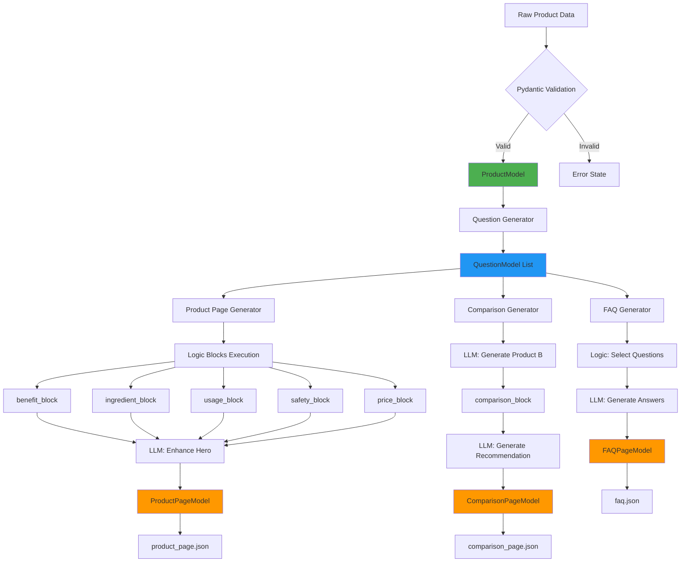

# Agentic Content Generation System

### What Does This Project Do?

The **Agentic Content Generation System** is a modular, multi-agent automation pipeline that transforms raw product data into comprehensive, structured content pages. It demonstrates advanced system design principles including:

- **Multi-agent orchestration** using LangGraph
- **Reusable content logic** through composable blocks
- **Template-driven generation** with declarative structures
- **Type-safe execution** with Pydantic validation
- **Machine-readable output** as structured JSON

### Problem Statement

Manual content creation for e-commerce products is:
-  Time-consuming (hours per product)
-  Inconsistent (varies by writer)
-  Difficult to scale (100s of products)
-  Hard to update (requires rewriting)

### Solution

An automated system that:
1. **Parses** product data into validated models
2. **Generates** relevant customer questions
3. **Creates** three complete content pages:
   - FAQ page with Q&As
   - Product description page
   - Comparison page (with fictional competitor)
4. **Outputs** everything as clean, structured JSON

### Key Features

 **Modular Architecture**: 6 independent agents with single responsibilities  
 **Reusable Components**: 6 logic blocks used across multiple agents  
 **Template System**: Declarative page structures  
 **Type Safety**: Full Pydantic validation throughout  
 **Error Handling**: Fallback strategies at every step  
 **Observability**: Detailed logging and state tracking  
 **Production Ready**: Scalable to 1000s of products  

---

##  How It Works

### Input  Process  Output Flow

```
INPUT
product_data.json (8 fields)
name, concentration, skin_types
ingredients, benefits, usage
side_effects, price

PROCESSING (6 Agents)
Agent 1: Parse & Validate Data
Agent 2: Generate 18 Questions
Agent 4: Create FAQ Page (5-10 Q&As)
Agent 5: Create Product Page (6 sections)
Agent 6: Create Comparison Page (with Product B)

OUTPUT
faq.json (FAQ page with answers)
product_page.json (complete product description)
comparison_page.json (side-by-side comparison)

```

### Execution Steps

1. **Data Validation**: Raw JSON  ProductModel (Pydantic)
2. **Question Generation**: LLM generates 18 categorized questions
3. **Parallel Page Generation**:
   - FAQ Agent: Selects questions + generates answers
   - Product Agent: Combines logic blocks + LLM enhancement
   - Comparison Agent: Creates Product B + comparison matrix
4. **Output Writing**: All pages saved as structured JSON

### Technology Stack

| Component | Technology | Purpose |
|-----------|-----------|---------|
| **LLM** | GPT-4o-mini | Content generation with structured output |
| **Orchestration** | LangGraph | Multi-agent workflow DAG |
| **Framework** | LangChain | Agent abstractions, prompt templates |
| **Validation** | Pydantic v2 | Type safety, structured output |
| **Language** | Python 3.11 |

---

##  System Architecture

### High-Level Architecture Diagram



---

## Folder Structure 

```
 README.md
 docs/
    projectdocumentation.md
 requirements.txt
 .env
 main.py

 src/
    __init__.py
    models/
    utils/
    logic_blocks/
    templates/
    orchestration/
    agents/

 data/
    input/
        product_data.json

 output/
     faq.json
     product_page.json
     comparison_page.json
```